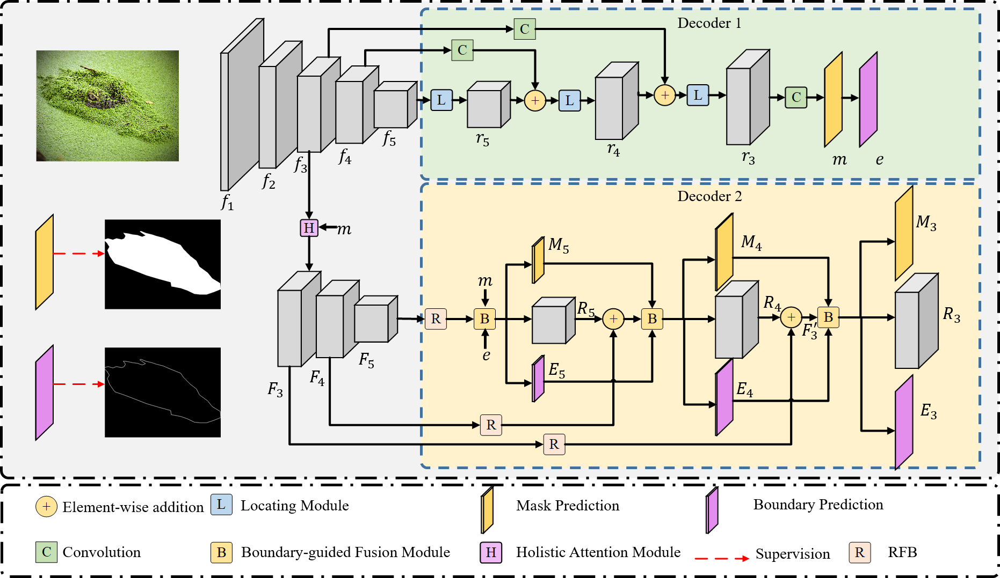
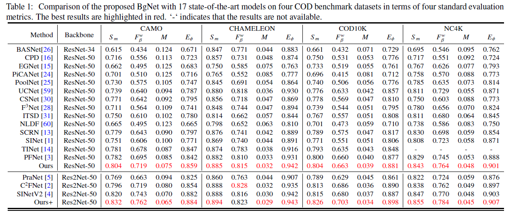
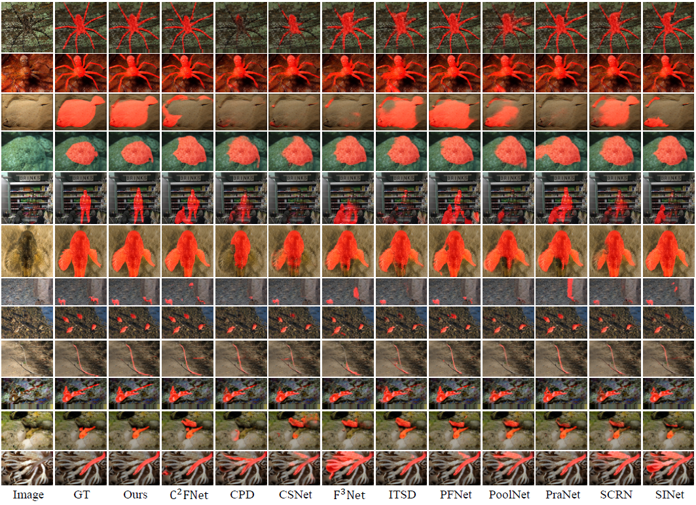

# BgNet
# [Boundary-guided Network for Camouflaged Object Detection](https://doi.org/10.1016/j.knosys.2022.108901)

This repo. is an official implementation of the *BgNet* , which has been accepted in the journal *Knowledge-based systems, 2022*. 

The main pipeline is shown as the following, 


And some results are presented



## Dependencies 
```
>= Pytorch 1.0.0
OpenCV-Python
[optional] matlab
```

## Datasets
Training and testing datasets are available at 

([Baidu](https://pan.baidu.com/s/1sJ8h8srJg0gmVE-kJLJ4og)) [code:q5e4]

([Google](https://drive.google.com/file/d/1VS8qVUjC__4BZhB-13S3wHDWAs_-YFDI/view?usp=sharing))

## Training
```
python train.py
```

## Test
```
 python test.py
```
We provide the trained model file 
([Baidu Res2Net](https://pan.baidu.com/s/1sHSPhGvQJszpN97stzuxFA)) [code:1fau]
([Baidu ResNet](https://pan.baidu.com/s/1DRis1YEsakb8ZXrSzOhtKQ)) [code:lzzo]

([Google Res2Net](https://pan.baidu.com/s/1sHSPhGvQJszpN97stzuxFA)) [code:1fau]
([Google ResNet](https://pan.baidu.com/s/1DRis1YEsakb8ZXrSzOhtKQ)) [code:lzzo]

The prediction maps are also available
([Res2Net](https://drive.google.com/file/d/1cTwLG0AiksPhE5QGX2mAc9S4Lm9vqkKK/view?usp=share_link))
([ResNet](https://drive.google.com/file/d/1ttOVmsqwayiel_E5vY4wZK50gVb75hjv/view?usp=share_link))

## Citation
Please cite the `BgNet` in your publications if it helps your research:
```
@article{CHEN2022,
  title = {Boundary-guided Network for Camouflaged Object Detection},
  author = {Tianyou Chen and Jin Xiao and Xiaoguang Hu and Guofeng Zhang and Shaojie Wang},
  journal = {Knowledge-Based Systems},
  year = {2022},
}
```
## Reference
[BBSNet](https://github.com/zyjwuyan/BBS-Net)
[CPD](https://github.com/wuzhe71/CPD)
